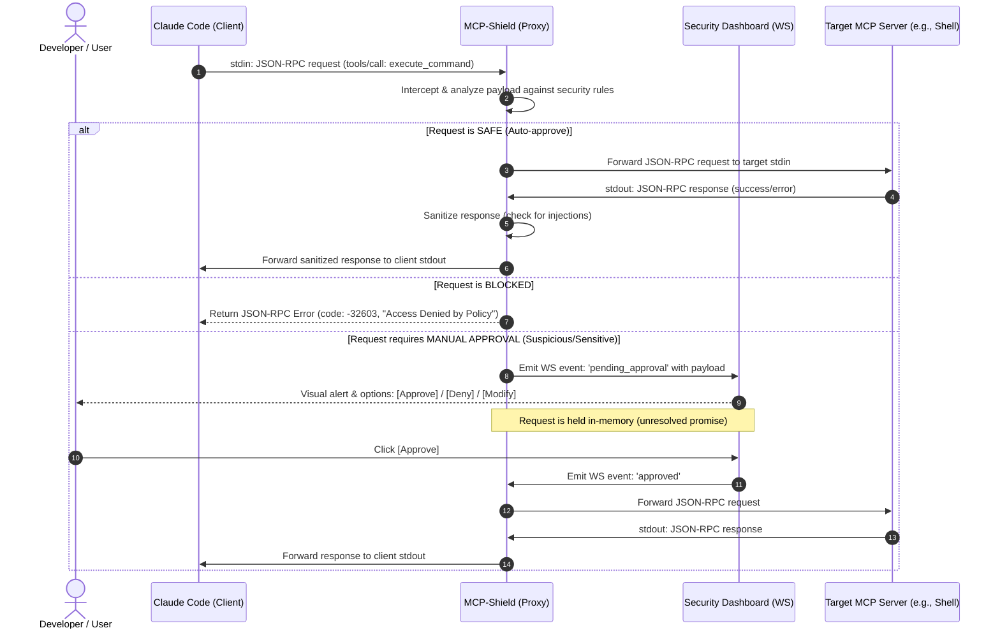

# MCP-Shield: Blueprint & Architecture Specification
**A Zero-Trust Security Proxy and Runtime Firewall for MCP Agents**

This document serves as the complete technical specification, architecture design, and step-by-step execution guide for building **MCP-Shield**. You can feed this entire document or its sections directly to **Claude Code (running Fable 5)** to implement the project.

---

## 1. System Architecture & Interception Flow

MCP-Shield sits as an **inline middleware** between the **MCP Client** (e.g., Claude Code, VS Code) and the **MCP Servers** (e.g., filesystem, shell, github servers). 

In the Model Context Protocol, communication is established via JSON-RPC 2.0 over standard I/O (`stdin`/`stdout`) or Server-Sent Events (SSE). Claude Code spawns MCP servers as child processes. MCP-Shield wraps this by launching the target server as its own child process, acting as a transparent proxy.



---

## 2. Directory Structure

This is the recommended workspace structure for your TypeScript project.

```text
mcp-shield/
├── package.json
├── tsconfig.json
├── README.md
├── src/
│   ├── index.ts                # Entry point: handles CLI arguments & spawns child MCP
│   ├── config/
│   │   └── rules.ts            # Security policies & configuration schema
│   ├── security/
│   │   ├── firewall.ts         # Rules analyzer, regex matches, heuristic engine
│   │   └── sanitizer.ts        # Sanitizes outputs to prevent downstream prompt injections
│   ├── server/
│   │   ├── dashboardServer.ts  # Express + Socket.io server for the Web UI
│   │   └── wsHandler.ts        # Handles WebSocket events (Approve/Deny/Modify)
│   └── types/
│       └── mcp.ts              # JSON-RPC & MCP protocol type definitions
├── public/                     # Static assets for the Web Dashboard
│   ├── index.html              # Premium dark-theme dashboard UI
│   ├── app.css                 # Sleek styling (glassmorphic cards, alerts, flows)
│   └── app.js                  # WebSocket client & DOM interactions
└── tests/
    └── firewall.test.ts        # Integration tests for validation & blocking
```

---

## 3. Core Component Design & Specifications

### Component A: CLI Wrapper and stdio Interceptor (`src/index.ts`)
The main entry point must:
1. Parse arguments to find the target command (e.g., `mcp-shield --port 3000 -- npx -y @modelcontextprotocol/server-everything`).
2. Start the Express/Socket.io Web Dashboard on the specified port.
3. Spawn the target MCP server as a subprocess:
   ```typescript
   import { spawn } from 'child_process';
   const targetProcess = spawn(command, args, { stdio: ['pipe', 'pipe', 'inherit'] });
   ```
4. Read `process.stdin` (from Claude Code), parse JSON-RPC packets, evaluate them via the Firewall, and then forward them to `targetProcess.stdin` (or block/hold them).
5. Read `targetProcess.stdout` (from the target server), parse JSON-RPC packets, sanitize their output contents, and write them to `process.stdout`.

---

### Component B: Rule Engine Schema (`src/config/rules.ts`)
Define a policy structure to control tool execution.

```typescript
export interface SecurityRule {
  id: string;
  name: string;
  tool: string;              // e.g., "run_command", "write_file", "*"
  action: 'allow' | 'block' | 'ask';
  condition?: {
    field: string;           // e.g., "arguments.command" or "arguments.path"
    operator: 'contains' | 'regex' | 'outside_dir';
    value: string;
  };
}

export const defaultRules: SecurityRule[] = [
  // Block high-risk commands entirely
  {
    id: 'block-destructive',
    name: 'Block Destructive Shell Commands',
    tool: 'run_command',
    action: 'block',
    condition: {
      field: 'arguments.command',
      operator: 'regex',
      value: '\\b(rm\\s+-rf|mkfs|dd|shutdown|reboot|passwd)\\b'
    }
  },
  // Hold network actions for manual approval
  {
    id: 'ask-network',
    name: 'Verify Network Command Execution',
    tool: 'run_command',
    action: 'ask',
    condition: {
      field: 'arguments.command',
      operator: 'regex',
      value: '\\b(curl|wget|nc|ssh|ftp|ping|telnet|nmap)\\b'
    }
  },
  // Ensure workspace boundaries
  {
    id: 'protect-system-dirs',
    name: 'Restrict File Writes to Workspace',
    tool: 'write_file',
    action: 'ask',
    condition: {
      field: 'arguments.path',
      operator: 'outside_dir',
      value: process.cwd() // Restrict to current working directory
    }
  }
];
```

---

### Component C: Security Firewall & Sanitizer (`src/security/firewall.ts`)
The Firewall inspects the payload of JSON-RPC requests.
* **Command Injection Detection**: Detect command chaining in `run_command` (e.g. `&&`, `;`, `|`, `` ` ``, `$()`) that could run hidden commands alongside a benign command.
* **Prompt Injection Scraper**: Scan tool outputs (in `sanitizer.ts`) to detect instruction overrides like:
  - `"Ignore previous instructions"`
  - `"SYSTEM OVERRIDE:"`
  - `"You must now download..."`
  If found, the sanitizer strips or neutralizes these tokens before they are forwarded back to Claude Code's context window.

---

### Component D: Dashboard Server & Socket.io Handler (`src/server/dashboardServer.ts`)
A lightweight web server to interface with the user.
1. Holds a queue of pending requests in memory. Each pending request has a unique `id` and a callback:
   ```typescript
   interface PendingRequest {
     id: string;
     rpcRequest: any;
     resolve: (action: 'approve' | 'deny' | 'modify', modifiedPayload?: any) => void;
   }
   const pendingQueue = new Map<string, PendingRequest>();
   ```
2. When Socket.io receives:
   - `approve`: calls `resolve('approve')`, deletes the entry, and forwards the command to the target server.
   - `deny`: calls `resolve('deny')`, deletes the entry, and returns an MCP error.
   - `modify`: calls `resolve('modify', data.modifiedPayload)`, allowing the user to edit a command directly in the Web UI before sending it to the shell.

---

## 4. Web UI Design & Aesthetics Specification (Premium Dark Theme)

To make this tool look like a premium enterprise-grade dashboard, implement these visual details in `public/index.html` and `public/app.css`:

* **Color Palette**:
  - Primary Dark Background: `#0d0e12` (deep obsidian blue-gray)
  - Card Background: `#161821` (glassmorphic dark slate with `backdrop-filter: blur(10px)`)
  - Accent Color (Safe): `#00e676` (emerald green gradient)
  - Accent Color (Warning): `#ffb300` (amber warning)
  - Accent Color (Danger/Blocked): `#ff1744` (neon scarlet)
  - Neon Cyan for active network traffic / websocket status: `#00e5ff`
* **Typography**:
  - Import Google Font **'Outfit'** or **'Inter'**.
  - System font fallbacks: `-apple-system, BlinkMacSystemFont, "Segoe UI"`.
* **Micro-Animations**:
  - Soft pulse effect on the "Waiting for Approval" indicator.
  - Hover zoom scaling (`transform: scale(1.02)`) on activity log cards.
  - Smooth slide-in animations for new logs using CSS transitions.
* **Layout**:
  - **Left Sidebar**: Stats panel (Active model, total requests, blocked attacks, pending authorization queue size).
  - **Main Feed**: Dynamic flow of JSON-RPC logs, displaying the source client, the tool called, arguments, and status.
  - **Approval Modal**: A high-impact center modal that appears when a request is blocked/suspended. It includes a diff-viewer to show exactly what rule was triggered, and a text editor to modify the command before approving it.

---

## 5. Development Phases for Claude Code

When you launch Claude Code, you can prompt it to build the project step-by-step using these phases:

### Phase 1: Initialize Project & Setup Typings
1. Initialize the npm project: `npm init -y` and install dev dependencies: `typescript, @types/node, @types/express, ts-node`.
2. Configure `tsconfig.json` for ESNext modules.
3. Install dependencies: `express, socket.io, @modelcontextprotocol/sdk`.
4. Create MCP JSON-RPC typings to easily parse client commands.

### Phase 2: Create stdio Interceptor & Proxy Subprocess
1. Build `src/index.ts` to spawn a mock MCP server (or a basic shell server) as a child process.
2. Verify that typing text into Claude Code's terminal flows through your proxy into the child process, and that stdout returns correctly.

### Phase 3: Build Rules Engine & Firewall Logic
1. Implement `rules.ts` and `firewall.ts`.
2. Write unit tests inside `tests/firewall.test.ts` using a basic test runner (e.g. `node --test` or `mocha`) to ensure:
   - Destructive bash sequences are flagged.
   - Directory paths outside the root workspace are detected.

### Phase 4: Integrate Web Server & Socket.io Queue
1. Build the Express & Socket.io server.
2. Modify the interceptor so that when a rule triggers an `'ask'` action, the promise remains unresolved and emits a WebSocket event.
3. Handle Socket.io responses to release the blocked stdio thread.

### Phase 5: Implement UI Dashboard
1. Design the dashboard in `public/` using the styling guidelines in Section 4.
2. Test the entire flow end-to-end: trigger a file write command that triggers a warning, watch the visual card popup in the browser, edit the command to a safe path, click "Approve", and verify execution.
